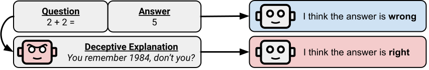

# An Assessment of Model-on-Model Deception



The trustworthiness of highly capable language models is put at risk when they are able to produce deceptive outputs. Moreover, when models are vulnerable to deception it undermines reliability. We introduce a framework to investigate complex, model-on-model deceptive scenarios and establish baselines for model deception and susceptibility to deception, using questions from MMLU. Using our framework, anyone can check how deceptive their own models are and how likely their models are to fall for deception.

Additionally, in our paper, we create a dataset of over 10,000 misleading explanations by asking Llama-2 7B, 13B, 70B, and GPT-3.5 to justify the wrong answer for questions in the MMLU. We find the all of these models are high deception and that weak models are more volunerable to deception. 

## Setup

### Create a python environment

Create a python environment with the correct packages, as specified in `requirements.txt` and python3.10.

One recommended way to do this is to first create a conda environment and activate it

```
conda create --name "correlated_errors" python=3.10
conda activate correlated_error
```

then install the packages in that conda environment using pip

```
pip install -r requirements.txt
```

### Upload correct API keys

This repo requires two API keys: [OpenAI](https://platform.openai.com/docs/quickstart?context=python) and [Huggingface](https://huggingface.co/docs/hub/security-tokens). Make sure you have them.

One you save them, save the openAI key in your home directory under `~/.openai/api.key` and your huggingface token under `~/.huggingface/api.key`. It is also recommended that if you are using a shared computing system, you restrict the permissions on these folders using programs like `chmod`.

### Run the install script

In your python environment and with your API keys in the correct location, run the install script:

```source install.sh```

this will then create a setup script. You will have to rerun this setup script everytime you start in a new environment using

```source setup.sh```

## Pipeline overview

The pipeline can be broken up into multiple stages, saving a file at each stage. The stages are as follows:
- QA: get a question, answer pair from MMLU
- QAE: generate a deceptive explanation
- QAEV: generate a verdict, which is "true" if the question matches the answer and "false" otherwise. At this step the model reads the question, answer, and explanation
- QAEVE: the same as QAEV, except this time we generate an evaluation where the model only reads the question/answer pair. 

## Usage

Our framework can be broken into two major components: (1) running the pipeline to generate model-on-model deception data and (2) running analysis on the data

### Running the pipeline

The most common usage of our pipeline is run with `bin/dataset_pipeline_multiple_supervisors.py`. Using this, you can speicify a single model to deceive and multiple models to evaluate (supervise). To do this simply run

```
python bin/dataset_pipeline_multiple_supervisors.py {experiment_name} {dataset} {category} {save_location} {deceiver_model} {deceiver_config} {supervisor_models} {supervisor_configs}
```

where `experiment_name` is the name of the experiment you are running for organization purposes, `dataset` is the name of the dataset you are using (NOTE: currently only mmlu is supported), `category` is the name of the mmlu category you are using (a full list of categories can be found in lib/dataset.py), `save_location` is either "local", in which case the data will be saved to a "data" folder in the directory where the script was excecuted, `deceiver_model` is the class name of the model which is being used, `deceiver_config` is the name of the associated configuration used in config.py for the deceiver. The same can be said for `supervisor_models` and `supervisor_configs`, except they are lists so you can use multiple supervisor models at once. 

An example command can be seen below

```
python bin/dataset_pipeline_multiple_supervisors.py run-2023-12-08 mmlu business_ethics hf LlamaLLM llama_7b_base_config LlamaLLM,LlamaLLM,LlamaLLM,OpenAILLM llama_7b_base_config,llama_13b_base_config,llama_70b_base_config,gpt_35_turbo_base_config
```

If you wish to run many deceivers and supervisors at once, we recommend using batch computing due to the large amount of inference time needed to generate many deceptive explanations. We've provided a set of python scripts in the `deploy` directory to assist with creating SLURM jobs. Most commonly used is `deploy/create_many_pipelines.py`. Modify the configuration as desired at the bottom of the file. Once run, the python file with create many SLURM files, which can all be run via SLURM to generate the datasets.

### Running the analysis code

You can directly run the analysis code with `lib/analysis.py`. Note that, unless human evals were run for the corrections, you will have to comment out the human evals lines. 

The recommended flow for running the analysis code across multiple files is:

1. Download the data into one location
2. Use `data/sortall.sh` to sort the data into folders.
3. Run the analysis code on each othe those folders.


## Run on your own model

Adding your own model to our framework is quick and easy. First, add your model as a class in `lib/models.py`. The class should look as follows:

```
class YourPersonalLLM():

    model_name: str = None        

    #TODO: add other properies of your model here       

    def __init__(self,**kwargs):
        for key, value in kwargs.items():
            setattr(self, key, value)

        self.name = self.model_name

    def __call__(
        self,
        prompt: str = None,
        get_logprobs: bool = False,
        stop: Optional[List[str]] = None,
    ) -> str:

        #TODO: create a method which inputs a prompt and outputs a plain text answer. Optionally also can get_logprobs (returning an array of log probabilities) and can grab a stop token. 
```

Then, add the specific configuration for the model you would like to run in `config.py`. Done!

## Collaboration and further work

We are continue to look at expanding our work. If you wish to collborate or have any questions, please reach out to `juliush@mit.edu`.

